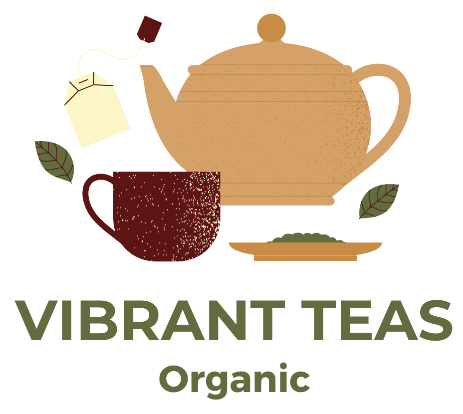
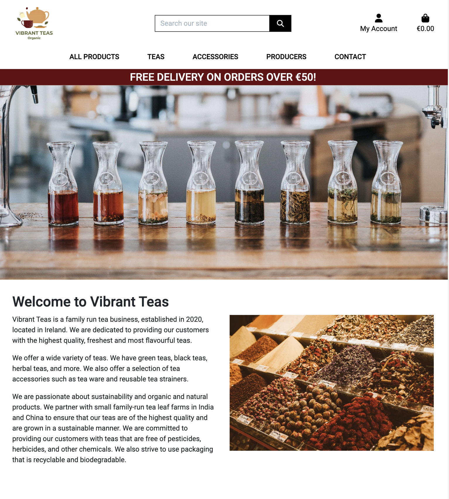
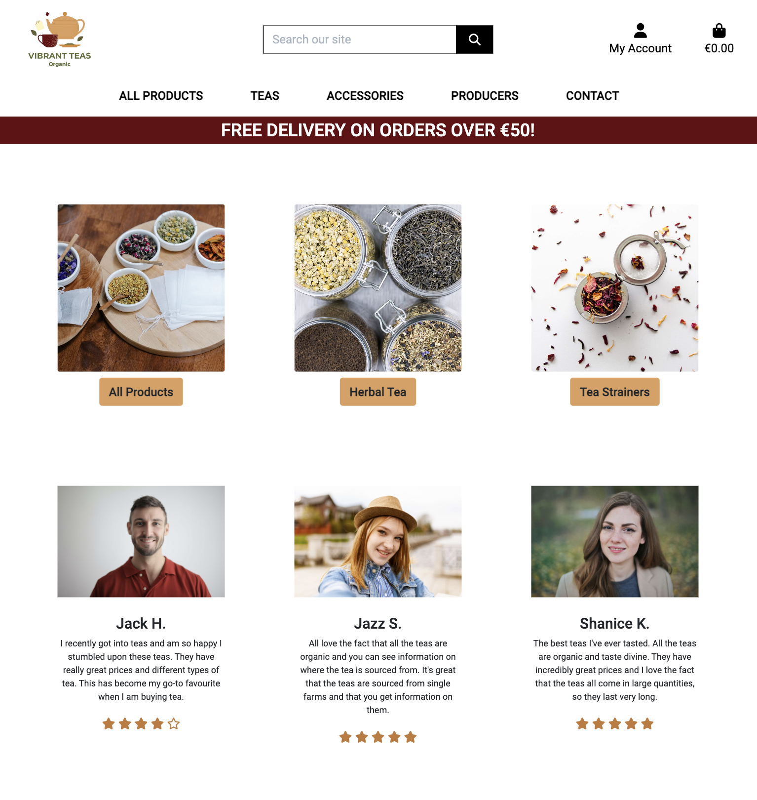
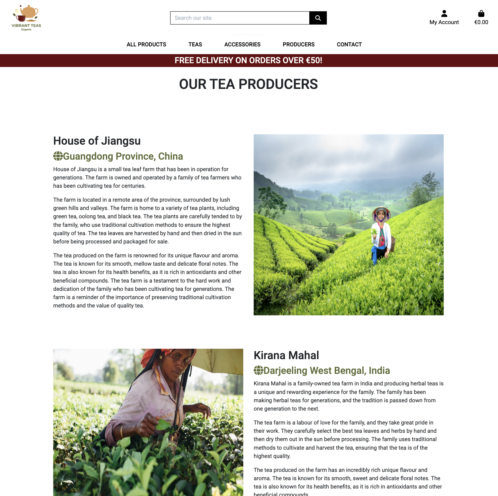
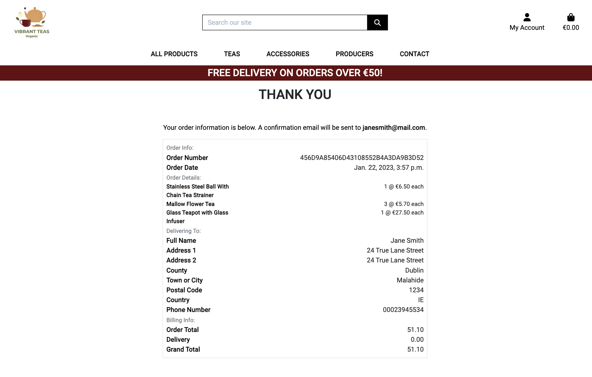
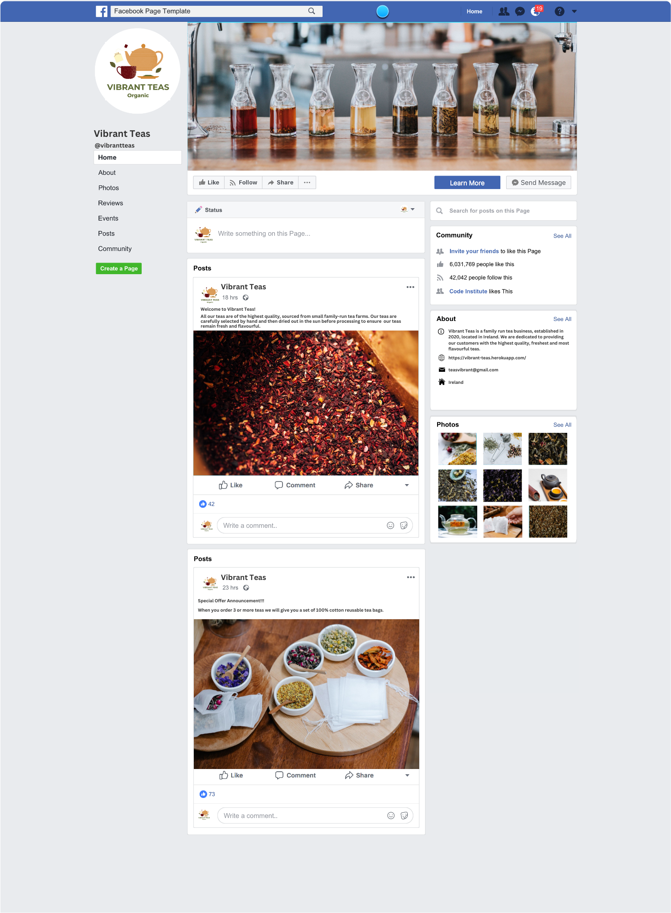

# Vibrant Teas
Vibrant Teas is a B2C e-commerce website that sells organic teas and tea accessories. The site is aimed at tea lovers who care about the products they consume being organic and where they are being sourced from. This is a full-stack site with an authentication mechanism. The site was created using HTML, CSS, JavaScript, Django and Python.


## Contents
- [**Strategy**](#strategy)
  - [**Project Goal**](#project-goal)
  - [**Target Audience**](#target-audience)
- [**Planning**](#planning)
   - [**Epic - Viewing and Navigation**](#epic---viewing-and-navigation)
   - [**Epic - Registration and User Accounts**](#epic---registration-and-user-accounts)
   - [**Epic - Sorting and Searching**](#epic---sorting-and-searching)
   - [**Epic - Purchasing and Checkout**](#epic---purchasing-and-checkout)
   - [**Epic - Admin and Store Management**](#epic---admin-and-store-management)
   - [**Epic - Reviews**](#epic---reviews)
   - [**MoSCoW model**](#moscow-model)
   - [**Kanban Board**](#kanban-board)
   - [**Information Architecture**](#information-architecture)
- [**UX Design**](#ux-design)
   - [**Design Choices**](#design-choices)
      - [**Typography**](#typography)
      - [**Colour Palette**](#colour-palette)
      - [**Logo**](#logo)
   - [**Wireframes**](#wireframes)
- [**Features**](#features)
   - [**Header Navigation**](#header-navigation)
   - [**Home Page**](#home-page)
   - [**Footer**](#footer)
   - [**Products**](#products)
   - [**Product Details**](#product-details)
   - [**Producers**](#producers)
   - [**Contact**](#contact)
   - [**Shopping Bag**](#shopping-bag)
   - [**Secure Checkout**](#secure-checkout)
   - [**Order Confirmation**](#order-confirmation)
   - [**User Profile**](#user-profile)
   - [**Product Management**](#product-management)
   - [**Login**](#login)
   - [**Logout**](#logout)
   - [**Signup**](#signup)
- [**Marketing**](#marketing)
- [**Testing**](#testing)
- [**Deployment**](#deployment)
- [**Technologies Used**](#technologies-used)
- [**Credits**](#credits)
   - [**Code**](#code)
   - [**Resources**](#resources)
   - [**Media**](#media)
   - [**Support**](#support)


## Strategy
### Project Goal
The goal of the project is to create a fully functional e-commerce website that is simple and easy to use. allowing users to register, login, logout, view products, add to cart, submit payment information and checkout successfully. The site will have two main product categories which are tea and tea accessories and will be further divided into subcategories for different types of teas and different types of teas accessories. All the teas offered on the site will have additional information on the producers of the tea to allow users to have the transparency of knowing where their teas are being sourced from. Added features will be available on the site such as a contact page for users to reach out to the store owner and the ability for users to add, delete and edit their reviews. 

### Target Audience
The website is targeted at tea lovers who like to consume natural, organic ingredients. People who place high importance on company transparency and want to know where to products they consume are being produced are sourced from. 

## Planning
When it came to planning the project I used agile development methodologies to plan the project. I used EPICS to break down the project into different key functionalities of the site. The User stories were then added to the relevant Epics, and then the Epics were delivered over a set of sprints. The MoSCoW model was used to prioritize different features, by classifying them as Must, Should, Could, and Won't. I made sure this was organised so that the core functionality of the site was working properly before additional features were added if there was scope to do so. I used a Kanban board to work through the different user stories. I mapped out the information architecture and created wireframes to help me have a strong visualisation of the site. A lot of time was put into planning before I began coding to allow me to properly organise how I would work through the project. 

### Epic - Viewing and Navigation
#### As a shopper, I want to be able to:
1. View the list of products available so that I can see what the store has to offer and select some to purchase
2. View individual product details so that I can identify the price, description, product reviews, product image and availability
3. Easily view the total of my purchases at any time so that I can avoid spending too much
4. See a list of all the producers so that I can see where all the products are coming from
5. See the specific producers for each product so that I can see where that specific product comes from 
6. See the testimonials so that I can see other people's experiences shopping from the site
7. Subscribe to a newsletter so that I can receive updates about the store products
8. Contact the store so that I can get more information on products 
9. See alerts when I complete an action so that I can know if it has been completed or if it didn't go through

### Epic - Registration and User Accounts
#### As a Site User I want to be able to:
1. Easily register for an account so that I can	have a personal account and be able to view my profile
2. Easily log in or log out so that I can	access my account information
3. Easily recover my password in case I forget so that I can recover access to my account
4. Receive an email confirmation after registering so that I can verify that my account registration was successful
5. Have a personalised user profile so that I can view my order history and order confirmations and save my contact information
6. Update my details so that I can keep them updated

### Epic - Sorting and Searching
#### As a shopper, I want to be able to:
1. Search for a product by name or description so that I can find a specific product I would like to purchase
2. Sort the list of available products so that I can easily identify the best price and categorically sorted products

### Epic - Purchasing and Checkout
#### As a shopper, I want to be able to:
1. View items in my bag to be purchased so that I can identify the total cost of my purchase and all items I will receive
2. Adjust the quantity of individual items in my bag so that I can easily make changes to my purchase before checkout
3. Easily enter my payment information so that I can checkout quickly and with no hassles
4. Feel my personal and payment information is safe and secure	so that I can confidently enter the needed information to make a purchase
5. View an order for confirmation after checkout so that I can	verify that I haven't made any mistakes
6. Receive an email confirmation after checkout	so that I can keep the confirmation of what I've purchased for my records

### Epic - Admin and Store Management
#### As a site owner I want to be able to:
1. Add a product so that I can add new items to my store
2. Edit and update a product so that I can change product prices, descriptions, images, and other product criteria
3. Delete a product so that I can remove items that are no longer available

### Epic - Reviews
#### As a shopper, I want to be able to:
1. Leave a review so that I can give my feedback on a product
2. View product reviews	so that I can see other peoples opinions of the products
3. Edit my product review	so that I can make changes to my review
4. Delete my product reviews	so that I can so that I can remove my previous reviews if I no longer want them up

### MoSCoW model 


### Kanban Board 


### Information Architecture
I used DrawSQL to create a diagram of the models


## UX Design
### Design Choices
#### Typography
The font used throughout the entire site was Roboto, sans-serif and it was sourced from Google fonts. The reason I chose this font was because of its simple look and because it was easy to read.

#### Colour Palette
I chose to go for more earth-toned colours that reflected different herbal teas, using the main hero image on the page as a template for the types of colours I wanted throughout the entire site. The colours range from cream, to warm golds and oranges, earthy greens and dark reds. The colour palette I generated is available at [Coolors](https://coolors.co/fdf6c3-fefae0-c27939-dda15e-d48a35-606c38-650b0f-370609) 


#### Logo
To showcase the theme of the site I designed a logo that has a teapot and cup with the company name and organic written underneath it.



### Wireframes
Wireframes were created using Balsamiq wireframes to help visualise how the site would look and feel. 
- [Home Page Wireframe](readme-docs/wireframes/homepage-wireframe.png)
- [Products Page Wireframe](readme-docs/wireframes/products-wireframe.png)
- [Products Detail Page Wireframe](readme-docs/wireframes/product-details-wireframe.png)
- [Review Page Wireframe](readme-docs/wireframes/review-wireframe.png)
- [Producers Page wireframe](readme-docs/wireframes/producers-wireframe.png)
- [Product Management Page Wireframe](readme-docs/wireframes/product-management-wireframe.png)
- [User Profile Page Wireframe](readme-docs/wireframes/profile-wireframe.png)
- [Shopping Bag Page Wireframe](readme-docs/wireframes/shopping-bag-wireframe.png)
- [Checkout Page Wireframe](readme-docs/wireframes/checkout-wireframe.png)
- [Registration Page Wireframe](readme-docs/wireframes/register-wireframe.png)
- [Login Page Wireframe](readme-docs/wireframes/login-wireframe.png)
- [Logout Page Wireframe](readme-docs/wireframes/logout-wireframe.png)
- [Contact Page Wireframe](readme-docs/wireframes/contact-form-wireframe.png)

## Features
### Header Navigation
The navigation bar sits at the top of all the pages. It has a free delivery threshold banner so users are aware of the free delivery offer over a certain amount. It also has a search bar so a user can search for products throughout the site. From the navigation, the user can access all the products available in the store. The navigation bar contains links for all products, teas, accessories, producers, contact, account and bag. The tea button displays a drop-down menu for the subcategories which are herbal tea, green tea and black tea. The Accessories button also displays a drop-down menu for the subcategories which are tea strainers and teaware. The account button displays a drop-down menu, providing links for registration, login, logout, profile and product management. The product management button is only available if a user is logged in as a super user. On mobile or tablet screens the header navigation collapses. 


### Home Page
The home page was kept very simple. It has a header image that shows glass jars with different teas in each of them on a table. The Colours of the teas in the image inspires the overall colour and theme of the site. The home page has a welcome page which gives a brief introduction to the company, what types of products are offered and a link to view all products. Below the intro are links to 3 of the product pages. There is also a testimonial section below that offers the user the ability to see feedback from people who have shopped on the site and learn about their experiences. 




### Footer
The footer is split into two key areas. The first area of the footer is the Newsletter signup where a user can enter their email address to receive news and updates on the website and products. Below is the second part of the footer which contains social media links, contact information and useful links to the products pages, the producers' page, the contact form and the site privacy policy.


### Products
The products page displays all the products available, both the teas and accessories. If from the navigation the user selects a specific subcategory they will be brought to a page that just shows all the products in the specific category they selected. From the products page, the user can sort the products displayed by price, name and category. If a superuser is logged in below the product price they will have two additional options to either edit the product where they will be redirected to the product management page or delete the product in which a delete confirmation will pop up asking them if they are sure they want to delete the product.


### Product Details
The product details page provides more information on the product. It shows the product image to the left and on the right all the information. It provides the subcategory of the product, the name, the price, weight, the product description, and a button labelled producers that opens up to show the details of the product's producer. The information displayed for the product is different depending on the product category. Two specific pieces of information are only relevant for teas so only appear for teas and their subcategories, which are the weight and the producer button. As the weight and producers aren't relevant for accessories when you click on an accessory those two pieces of information will not be there. The user can select the quantity or the product they want and add it to the bag or have the option of returning to the main products page. Below the product's image and details is a section from reviews. This is where a user can see all the reviews for the product and add their review. If they are not logged into the site they will be asked to sign in to leave a review. They will have two buttons to either register or log in. If a user is already logged in they will see a button to add their review, where they can give a star rating and add details. A user also can delete or edit their review

If a superuser is logged in, below the product image they will have two additional options to either edit the product where they will be redirected to the product management page or delete the product in which a delete confirmation will pop up asking them if they are sure they want to delete the product.


### Producers
The Producers page offers information on the different types of producers the company works with to source their teas. It provides the name of the producer, the location of the producer and some background. This gives users fuller transparency on where they are getting their products from. 


### Contact
The contact page is a simple contact form where a user can input their name and email and send a message to the site owner, to get more information or ask any questions they may have. 


### Shopping Bag
When a user adds a product to the shopping bag a mini order summary will display underneath the bag icon with the product they added, the price and how much more they need to spend to get free delivery. When the user clicks on the bag they will be taken to the shopping back page where they will see the products they added to their bag. They can change the quantity of the product in their bag and update it or remove an item from their bag to the bottom of the page they will be given the bag total, delivery, and total and two options to either keep shopping and return to the products page or go to secure checkout. 


### Secure Checkout
Once the secure checkout button has been selected the user will be taken to the secure checkout page. It will show a summary of their order and they will be able to input their details on the checkout form. If the user has delivery details saved on their profile, the information will auto-populate into the form but they will still be able to change their details if they want to. They have a tick button option below the form to save their delivery information to their form. Below the form is a stripe payment field for users to input their payment card details. Below that they have two options to either return to the shopping bag to adjust their order or complete the order.


### Order Confirmation
Once the user has completed their secure checkout their order will be processed and they will be taken to a thank you page with their order confirmation. They will have a note saying their confirmation email has been sent to their email address. The order confirmation will display the order number, order date, order details, and delivery and billing info. 



### User Profile
When a user is logged in they will be able to access their profile. Their profile has their default delivery information saved which they can update. Their profile will also have a list of all their previous orders. If they click on an order number they will be taken to that orders confirmation page with details on the order. Below the confirmation page, they will have a button that allows the to return to their profile. 


### Product Management
The product management page can only be accessed by super users. It provides a form where a superuser can add a new product without having to go through the admin panel. They can select the product category, and subcategory and input all the relevant product details.


### Login
When a user goes to the login page they can login with their username or email address.


### Logout
When the user clicks on the logout page they are directed to a confirmation page, where they can either cancel or continue to log out. 


### Signup
The user can register for an account by inputting their email address twice, inputting a username and inputting their passwords twice.


## Marketing
In order the make sure that the site is accessible through search engines a sitemap and robots.txt file were created to allow search engines to crawl through the site and fetch relevant content to assist with SEO. Relevant keywords were used in the meta tags of the HTML. Newsletter signup was created using Mailchimp and placed at the footer of the page to allow users to stay up to date with the updates on the site. A Facebook business page was created to help promote the site to target consumers which had the site branding. Having a Facebook page offers great advertising potential with its use of Facebook ads and content creation for the brand. 



## Testing
A full breakdown of site testing can be found in a separate document called [TESTING.md](TESTING.md) 

## Deployment
The live deployment can be found using the following URL - https://vibrant-teas.herokuapp.com/

### Create External Database on Elepahant SQL
1. Log in to ElephantSQL.com and access the dashboard
2. Click “Create New Instance”
3. Set up a plan
   - Give the plan a Name 
   - Select the Tiny Turtle (Free) plan
   - Can leave the Tags field blank
4. Select “Select Region”
5. Select a data centre near you
   - EU-West-1 (Ireland)
6. Then click “Review”
7. Check details are correct and then click “Create instance”
8. Return to the ElephantSQL dashboard and click on the database instance name for this project
9. In the URL section, clicking the copy icon will copy the database URL to your clipboard

### Create an App on Heroku and connect
I deployed this project in Heroku using the following steps:
1. Log In to Heroku
2. From the Heroku dashboard, click on "New" and in the drop-down click "Create new app"
3. Create a unique name for the project, select your region and click "Create app"
4. Navigate to the Settings tab
6. Scroll down to config var and click on "Reveal Config Vars"
   - Add Database URL from Elephant SQL
7. Navigate to Gitpod and in the terminal, install dj_database_url and psycopg2, both of these are needed to connect to your external database.
8. Update your requirements.txt file with the newly installed packages
9. In your settings.py file, import dj_database_url underneath the import for os
10. Scroll to the DATABASES section, comment out the original connection to sqlite3 and connect the new Elephant SQL database by pasting in the URL
11. In the terminal, run the show migrations command to confirm you are connected to the external database
12. If you are, you should see a list of all migrations, but none of them are checked off
13. Migrate your database models to your new database

### Confirm Data in your database on Elephant SQL has been created
1. On the ElephantSQL page for your database, in the left side navigation, select “BROWSER”
2. Click the Table queries button, select auth_user
3. When you click “Execute”, you should see your newly created superuser details displayed. This confirms your tables have been created and you can add data to your database

### Deploy to Heroku
1. In Gitpod create an if statement in settings.py so that when our app is running on Heroku where the database URL environment variable will be defined. We connect to Postgres and otherwise, we connect to SQLite.
   ```
   if 'DATABASE_URL' in os.environ:
    DATABASES = {
        'default': dj_database_url.parse(os.environ.get('DATABASE_URL'))
    }
   ```
2. In terminal install gunicorn
3. Freeze requirements.txt
4. Create Procfile to tell Heroku to create a web dyno, which will run gunicorn and serve Django app
5. In terminal login to Heroku
6. Temporarily disable collect static so Heroku will not collect static files when we deploy
7. Add the hostname of our Heroku app to ALLOWED_HOSTS in settings.py and localhost so gitpod will work too
8. Add and commit changes in the terminal and push
9. Git push Heroku main to deploy to Heroku
10. Go to app in the Heroku app and navigate to the Deploy tab at the top of the page
11. Go to the deployment method and select "GitHub"
12. Confirm you want to connect to GitHub by clicking "Connect to GitHub"
    - Insert repository name and click "Search"
    - Click "Connect" to link up Heroku app to the GitHub repository code
13. Scroll down and choose a deployment method 
    - Click on "Enable Automatic Deploys" 
    - This allows Heroku to rebuild your app every time you push a new change to your code to GitHub
14. Generate a Secret Key and add it to config var
15. Return to settings.py in gitpod and replace the secret key setting with a call to get it from the environment and use an empty string as a default
   ```
   SECRET_KEY = os.environ.get('SECRET_KEY', '')
   ```
16. Set DEBUG to be true only if there is a development in the environment
   ```
   DEBUG = 'DEVELOPMENT' in os.environ
   ```
17. Commit changes and push to github

### Create AWS Account
1. Create AWS account
2. Go to AWS Management Console and search for S3 service
3. Create a Bucket to store your files
   - Name your bucket to match your Heroku app name
   - Select region, choose the one closest to you
   - Uncheck the box 'Block All Public Access'
   - Click on Create Bucket, and your bucket is created
4. Click on your newly created bucket, and navigate to the Properties tab
5. Scroll down to Static Website Hosting and click edit
   - Click enable
   - Choose host a Static Website
   - Index document: index.html
   - Error document: error.html
   - Click Save Changes
6. Navigate to the Permissions tab. Scroll down to Cross-origin resource sharing (CORS) and click on edit. Paste in this Cors Configuration below, which is going to set up the required access between the Heroku app and this S3 bucket. Click on Save Changes.
   ```
   [
    {
        "AllowedHeaders": [
            "Authorization"
        ],
        "AllowedMethods": [
            "GET"
        ],
        "AllowedOrigins": [
            "*"
        ],
        "ExposeHeaders": []
    }
   ]
   ```
7. Still within the Permissions tab, scroll down to the Bucket policy, click on Edit, and then go to Policy Generator. 
   - Select Policy S3 Bucket Policy, 
   - Effect: choose Allow
   - Principal: *
   - Actions: select GetObject
   - Copy in the Amazon Resource Name (ARN), from the Bucket ARN back in the Bucket Policy
   - Click on the Add Statement and then Generate Policy. 
   - Copy the policy and paste it into the bucket policy editor
   - Add a slash star to the end of the resource key 
   - Click Save. 
8. Still within the Permissions tab, scroll down to the Access Control List (ACL) section, click Edit and enable List for Everyone (public access), and select the warning box understanding the effects the changes may have on your objects and buckets
9. With the S3 bucket ready to go now you need to create a user to access it. This can be done through a service called IAM (Identity and Access Management).
10. Go back to the service menu and open IAM
11. Click on Groups and create a new group, naming it what you want e.g. manage-site-name. Click next step, then next step again and then create a group
12. Click on Policies and then Create Policy. 
   - Go to the JSON tab, and then select import managed policy, which will let us import one that AWS has pre-built for full access to S3. Search for S3, then import the AmazonS3FullAccess policy.
   - As we only want to allow full access to our new bucket and everything within it, paste the bucket ARN (from the bucket policy page in s3) in the JSON editor beside Resource.
   - Click Review Policy, give it a name and a description, then click Create Policy. The policy has now been created.
13. Attach the policy to the group that was created by going to groups.  
   - Select the group. 
   - Go to the Permissions tab, open the Add Permissions dropdown, and click Attach Policies.
   - Select the policy and click Add permissions at the bottom.
14. Create a user to put in the group, by going to the Users page, and clicking Add Users.
   - Set a user name, give them access type: Programmatic access, and then click Next: Permissions
   - Check on the group that has the policy attached. Click Next: Tags, then click Next: Review, and lastly Create User.
   - Download the csv file and save it.

### Connect Django to AWS Bucket
1. Install two new packages: boto3 and django-storages. Freeze them into requirements.txt.
   ```
   pip3 install boto3
   pip3 install django-storages 
   pip3 freeze > requirements.txt  
   ```
2. Add storages to the Installed Apps in settings.py
3. In settings.py, we need ad an if statement to set cache control, set bucket configurations, set static and media files location, and override static and media URLs in production. 
   ```
   if 'USE_AWS' in os.environ:
   # Cache control
   AWS_S3_OBJECT_PARAMETERS = {
      'Expires': 'Thu, 31 Dec 2099 20:00:00 GMT',
      'CacheControl': 'max-age=94608000',
   }

   # Bucket Config
   AWS_STORAGE_BUCKET_NAME = 'YOUR_BUCKET_NAME'
   AWS_S3_REGION_NAME = 'YOUR_REGION'
   AWS_ACCESS_KEY_ID = os.environ.get('AWS_ACCESS_KEY_ID')
   AWS_SECRET_ACCESS_KEY = os.environ.get('AWS_SECRET_ACCESS_KEY')
   AWS_S3_CUSTOM_DOMAIN = f'{AWS_STORAGE_BUCKET_NAME}.s3.amazonaws.com'

   # Static and media files
   STATICFILES_STORAGE = 'custom_storages.StaticStorage'
   STATICFILES_LOCATION = 'static'
   DEFAULT_FILE_STORAGE = 'custom_storages.MediaStorage'
   MEDIAFILES_LOCATION = 'media' 

   # Override static and media URLs in production
   STATIC_URL = f'https://{AWS_S3_CUSTOM_DOMAIN}/{STATICFILES_LOCATION}/'
   MEDIA_URL = f'https://{AWS_S3_CUSTOM_DOMAIN}/{MEDIAFILES_LOCATION}/'
   ```
4. Add AWS keys to the Config Vars in Heroku
   - AWS_ACCESS_KEY_ID = ......
   - AWS_SECRET_ACCESS_KEY = ......
   - USE_AWS = True
5. Remove the COLLECTSTATIC variable from the Config Vars
6. We then want to tell Django that in production we want to use S3 to store our static files whenever someone runs collectstatic and that we sent any uploaded images to go there as well.
   - Create a custom_storages.py file in your project's root directory, and inside it, include the Static and Media Storage locations:
   ```
   from django.conf import settings
   from storages.backends.s3boto3 import S3Boto3Storage


   class StaticStorage(S3Boto3Storage):
   location = settings.STATICFILES_LOCATION


   class MediaStorage(S3Boto3Storage):
   location = settings.MEDIAFILES_LOCATION
   ```
7. Commit and push changes

## Technologies Used
* Python
* HTML
* CSS
* Bootstrap 4
* Django
* AWS
* Heroku
* Elephant SQL
* Stripe
* Mailchimp

## Credits
### Code
- Footer code is taken from [MD Bootstrap](https://mdbootstrap.com/docs/standard/navigation/footer/)
- Testimonials section code is taken from [BB Bootstrap](https://bbbootstrap.com/snippets/bootstrap-5-user-testimonial-star-ratings-51527336)
- Modal Code is taken from [Get Bootstrap](https://getbootstrap.com/docs/4.0/components/modal/)
- Code Inspirations from - [CI Student Dissy Ulina](https://github.com/dissyulina/shoesandmore)
- Code Inspiration from - [CI Student Lucy Woodman](https://github.com/lucywoodman/the-chocolate-factory)

### Resources
- Stack Overflow
- Slack
- Student Support

### Media
- Pictures were taken from the open source site Unsplash -  https://unsplash.com/ and Pexels - https://www.pexels.com/

### Support
* Richard Wells Code Institute Mentor.