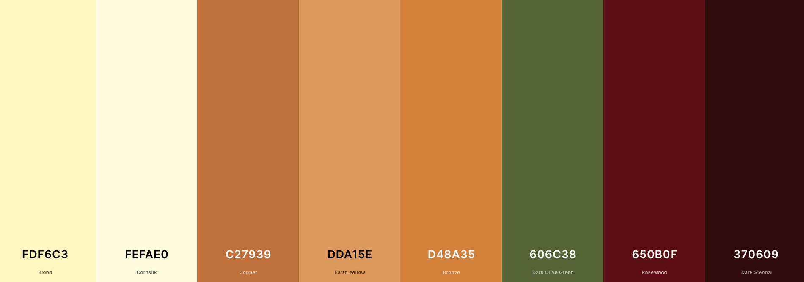

# Vibrant Teas
Vibrant Teas is B2C e-commerce website that sells organic teas and tea accessories. The site is aimed at tea lovers who care about the products they consume being organic and where they are being sourced from. The is a full stack site with an authentication mechanism. The site was created using HTML, CSS, JavaScript, Django and Python.

## Strategy
### Project Goal
The goal of the project is to create a fully functional e-commerce website that is simple and easy to use. allowing users to register, signin/logout, view products, add to cart, submit payment information and checkout sucessfully. The site will have two main product categories which are tea and tea accessories and will be further divided into subcategories for different types of teas and different types of teas accessories. All the teas offered on the site will have additional information on the producers of the tea to allow users to have the transparency of knowing where their teas are being sourced from. Added features will be available on the site such as a contact page for users to reach out to the store owner and the abilitiy for users to add, delete and edit their reviews. 

### Target Audience
The website is targetd at tea lovers who like to consumer natural, organic ingredients. People who place a high importance on company transparency and want to know where to products they consumer are being produced are sourced from. 

## Planning
When it came to planning the project I used agile development methodologies to plan the project. I used EPICS to break down the project into different key functionalities of the site. The User stories were then added to the relevant Epics, and then the Epics were delivered over a set of sprints. The MoSCoW model was used to prioritize different features, by classifying them as Must, Should, Could, and Won't. I made sure this was organised so that the core functionality of the site was working properlly before additional features were added, if there was scope to do so. I used a Kanban board to work through the different user stories. I mapped out the information architecture and created wireframes to help me have a strong visualisation of the site. Alot of time was put into planning before I began coding to allow me to properlly organise how I would work through the project. 

### Epic - Viewing and Navigation
#### As a shopper I want to be able to:
1. View the list of products available so that I can see what the store has to offer and select some to purchase
2. View individul product details so that I can identify the price, description, product reviews, product image and availability
3. Easily view the total of my purchases at any time so that I can avoid spending too much
4. See a list of all the producers so that I can see where all the products are coming from
5. See the specific producers for each product so that I can see where that specific product comes from 
6. See the testimonials so that I can see other peoples experiences shopping from the site
7. Subscribe to a newsletter so that I can receive updates about the store products
8. Contact the store so that I can get more information on products 
9. See alerts when I complete an action so that I can know if it has been successfully completed or if it didn't go through

### Epic - Registration and User Accounts
#### As a Site User I want to be able to:
1. Easily register for an account so that I can	have a personal account and be able to view my profile
2. Easily log in or log out so that I can	access my account information
3. Easily recover my password incase I forget so that I can recover access to my account
4. Receive an email confirmation after registering so that I can verify that my account registration was successful
5. Have a personlised user profile so that I can view my personal order history and order confirmations and save my contact information
6. Update my personal details so that I can keep them updated

### Epic - Sorting and Searching
#### As a shopper I want to be able to:
1. Search for a product by name or description so that I can find a specific product I would like to purchase
2. Sort the list of available products so that I can easily identify the best price and categorically sorted products

### Epic - Purchasing and Checkout
#### As a shopper I want to be able to:
1. View items in my bag to be purchased so that I can identify the total cost of my purchase and all items I will receive
2. Adjust the quatity of idividual items in my bag so that I can easily make changes to my purchase before checkout
3. Easily enter my payment information so that I cancCheckout quickly and with no hassles
4. Feel my personal and payment information is safe and secure	so that I can sonfidently enter the needed information to make a purchse
5. View an order for confirmation after checkout so that I can	verify that I havent made any mistakes
6. Receive an email confirmation after checkout	so that I can keep the confirmation of what I've purchsed for my records

### Epic - Admin and Store Management
#### As a site owner I want to be able to:
1. Add a product so that I can add new items to my store
2. Edit and update a product so that I can change product prices, descriptions, images, and other product criteria
3. Delete a product so that I can remove items that are no longer available

### Epic - Reviews
#### As a shopper I want to be able to:
1. Leave a review so that I can give my feedback on a product
2. View product reviews	so that I can see other peoples opinions of the products
3. Edit my product review	so that I can make changes to my review
4. Delete my product reviews	so that I can so that I can remove my previous reviews if I no longer want them up

### MoSCoW model 

### Kanban Board 

### Information Architecture
I used DrawSQL to create a diagram of the models

## UX Design
### Design Choices
#### Typography
The font used throughout the entire site was Roboto, sans-serif and it was sourced from Google fonts. The reason I chose this font was because of its simple look and because it was easy to read.

#### Colour Palette
I chose to go for more earth toned colours that reflected different herbal teas, using the main hero image on the page as a template for the types of colours I wanted throughout the entire site. The colours range from cream, to warm golds and oranges, earthy green and dark reds. The colour palette I generated is available at https://coolors.co/fdf6c3-fefae0-c27939-dda15e-d48a35-606c38-650b0f-370609 

#### Logo
To showcase the theme of the site I designed a logo that has a a teapot and cup with the company name and organic written underneath it

### Wireframes
Wireframes were created using Balsamiq wireframes to help visualise how the site would look and feel. 
- [Home Page Wireframe](readme-docs/wireframes/homepage-wireframe.png)
- [Products Page Wireframe](readme-docs/wireframes/products-wireframe.png)
- [Products Detail Page Wireframe](readme-docs/wireframes/product-details-wireframe.png)
- [Review Page Wireframe](readme-docs/wireframes/review-wireframe.png)
- [Producers Page wireframe](readme-docs/wireframes/producers-wireframe.png)
- [Product management Page Wireframe](readme-docs/wireframes/product-management-wireframe.png)
- [User Profile Page Wireframe](readme-docs/wireframes/profile-wireframe.png)
- [Shopping Bag Page Wireframe](readme-docs/wireframes/shopping-bag-wireframe.png)
- [Checkout Page Wireframe](readme-docs/wireframes/checkout-wireframe.png)
- [Registration Page Wireframe](readme-docs/wireframes/register-wireframe.png)
- [Login Page Wireframe](readme-docs/wireframes/login-wireframe.png)
- [Logout Page Wireframe](readme-docs/wireframes/logout-wireframe.png)
- [Contact Page Wireframe](readme-docs/wireframes/contact-form-wireframe.png)

## Features
### Header Navigation
The navigation bar sits at the top of all the pages. It has a free delivery threshold bannner so users are awar of the free delivery offer over a certain amount. It also has a search bar so a user can search for products throughout the site. From the navigation the user can access all the products available on the store.The navigation bar contains links for all products, teas, accessories, producers, contact, account and bag. The tea button displays a drop down menu for the subcategories which are herbal tea, green tea and black tea. The Accessories button also displays a drop down menu for the subcategories which are tea strainers and teaware. The account button displays a drop down menu, providing links for registration, login, logout, profile and product management. The product management button is only available is a user is logged in as a super user. On mobile or tablet screens the header navigation collapses. 

### Home Page
The home page was kept very simple. It has a welcome page which gives a brief introduction to the company, what type of products offered and a link to view all products. There is also a testimonial section below that offers user the ability to see feedback from people who have shopped on the site and learn of their experiences. 

### Footer
The footer is split into two key areas. The first area of the footer is the Newsletter signup where a user can enter their email address o receive news and updates on the website and products. Below it is the second part of the footer that contains social media links, contact information and useful links to the products pages, the producers page, the contact form and the site privacy policy.

### Products
The products page displays all the products available, both the teas and accessories. If from the navigation the user selectes a specific subcategory they will be brought to a page that just shows all the products in the specific category they selected. From the products page the user has the ability to sort the products displayed by price, name and category. If a superuser is logged in below the product price they will have two additional optins to either edit the product where they will be redirected to the product management page or delete the product in which a delete confirmation will pop up asking them if they are sure they want to delete the product.

### Product Details
The product details page provides more information on the product. It shows the product image to the left and on the right all the information. It provides the subcategory of the product, the name, the price, weight, the product description, and a button labelled producers that opens up to show the details of the products producer. The information displayed for the product is different depending on the product category. Two specific pieces of information are only relevant for teas so only appear for teas and their subcategories, which are the weight and the producer button. As the weight and producers isn't relevant for accessories, when you click into an accessory those two pieces of information will not be there. The user can select the quantity or the product they want and add to bag or have the option of returning back to the main products page. Below the products image and details is a section from reviews. This is where a user can see all the reviews for the product and add their own review. If they are not logged into the site they will be asked to sign in to leave a review. They will have two buttons to either register or login. If a user is already loggedin they will see a button to add their own review, where they can give a star rating and add details. A user also has the ability to delete or edit their own review

If a superuser is logged in, below the product image they will have two additional optins to either edit the product where they will be redirected to the product management page or delete the product in which a delete confirmation will pop up asking them if they are sure they want to delete the product.

### Producers
The Producers page offers information on the different types of producers the company works with to source their teas. It provides the name of the producer, the location of the producer and some background. This gives users fuller transparency on where they are getting their products from. 

### Contact
The contact page is a simple contact form where a user can input their name and email and send a message to the site owner, to get more information or ask any questions they may have. 

### Shopping Bag
When a user adds a product to the shopping bag a mini order summary will display underneath the bag icon with the product they added, the price and how much more they need to spend in order to get free delivery. When the user clicks on the bag they will be taken to the shopping back page where they will see the products they added to their bag. They have the ability to change the quantity of the product in their bag and update it or remove an item from their bag. to the bottom of the page they will be given the bag total, delivery, grand total and two options to either keep shopping and return to products page or go to secure checkout. 

### Secure Checkout
Once the secure checkout button has been selected the user will be taken to the secure checkout page. It will show a summary of their order and they will be able to input their details and on the checkout form. If the user has delivery details saved on their profile, the information will autopopulate into the form but they will still be able to change their details if they want to. They have a tick button option below the form to save their delivery information to their form. below the form is a stripe payment field for users to input their payment card details. Below that they have two options to either return to the shopping bag to adjust theit order or complete the order.

### Order Confirmation
Once the user has completed their secure checkout the their order will be processed and they will be taken to a thank yu page with their order confirmation. They will have a note saying their confirmation email has been sent to their email address. The order confirmation will display the order number, order date, their order details, their delivery and billing info. 

### User Profile
When a user is logged in they will be able to access their profile. Their profile has their default delivery information saved which they can update. Their profile will also have a list of all their previous orders. If they click on an order number they will be taken to that orders confirmation page with details on the order. Below the confirmation page they will have a button that allows the to return to their profile. 

### Product Management
The product management page can only be accessed by super users. It provides a form where a superuser can add a new product without having to go through the admin panel. They can select the product categroy, subcategory and input all the relevant product details.

### Login
When a user goes to the login page they can login in with their username or email address.

### Logout
When the user clicks on the logout page they are directed to a confirmation page, where they can either cancel or continue to log out. 

### Registration
The user can register for an account inputting their emaill address twice, inputting a username and inputting their passwords twice.

## Marketing
In order the make sure that the site is accessible through search engines a sitemap and robots.txt file was created to allow search engines to crawl through the site and fetch relevant content in order to assits with SEO. Relevant keywords were used in the meta tags of the HTML. A newsletter sigup was created using mailchimp and placed at the footer of the page to allow users to stay up to date with the updates on the site. A Facebook busines page was created to help promote the site to target consumers which had the site branding. Have a facebook page offers great advertising potential with its us of Facebook ads and content creation for the brand. 

## Testing
A full breakdown of site testing can be found in a seperate document called [TESTING.md](TESTING.md) 

## Deployment
The live deployment can be found using the following URL - https://events-planner-p3.herokuapp.com/

I deployed this project in Heroku using the following steps:
1. Log In to Heroku
2. From the Heroku dashboard, click on "New" and in the drop-down click "Create new app"
3. Create a unique name for the project, select your region and click "Create app"
4. Navigate to the Resources tab, under add-ons search for Heroku Postgres and.
5. Navigate to the Settings tab
6. Scroll down to config var and click on "Reveal Config Vars"
   - Add Cloudinary url
   - Add Database url
   - Add Secret key
   - Click "Add"
7. Using the code institute template, you must add another config var
   - In the field for KEY enter PORT
   - In the field for VALUE enter 8000
8. Navigate to the Deploy tab at the top of the page
9. Go to deployment method and select "GitHub"
10. Confirm you want to connect to GitHub by clicking "Connect to GitHub"
    - Insert repository name and click "Search"
    - Click "Connect" to link up Heroku app to the GitHub repository code
11. Scroll down and choose a deployment method 
    - In manual deploy click "Deploy Branch"
    - Then click on "Enable Automatic Deploys" 
   - This allows Heroku to rebuild your app every time you push a new change to your code to GitHub

## Technologies Used
* Python
* HTML
* CSS
* Bootstrap 4
* Django
* AWS
* Heroku

## Credits
- I used other people's projects for ideas and inspiration 
  - https://github.com/KarinOldbring/vegan-a-eat
  - https://github.com/dougiemath/photo_sharing_site  

### Media
- Pictures were taken from the open source site Unsplash -  https://unsplash.com/ and Pexels - https://www.pexels.com/

## Support
* Richard Wells Code Institute Mentor.

## Resources

https://mdbootstrap.com/docs/standard/navigation/footer/

https://bbbootstrap.com/snippets/bootstrap-5-user-testimonial-star-ratings-51527336

https://eteakol.com/collections/beyondarie

https://getbootstrap.com/docs/4.0/components/modal/