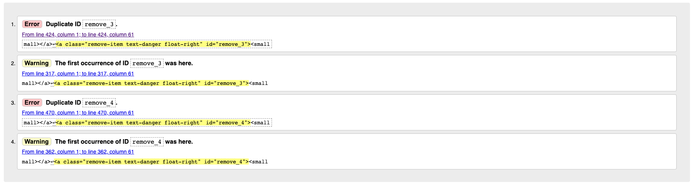
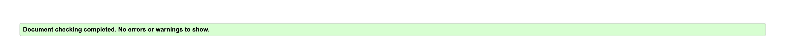

# Validation
## HTML
- Testing was carried out using Jigsaw - https://validator.w3.org/ 
- All pages passed except for the Product Management Page and the Shopping Bag.
- Product Management Page: The error said there was a duplicate ID image coming from the Django form, so I wasn't able to remove it.

- The Shopping bag had an error of duplicate ID. The main reason for this duplicate ID was that the include file for the quantity form has to appear twice in the DOM because it has a mobile view and a larger screen view. 

## CSS
- Testing was carried out using Validator - https://validator.w3.org/nu/
- No errors were found when passing through the validator.

## PEP8
- I used the PEP8 validator on my Gitpod Workspace. All pages were cleared. 

# Manual Testing
To ensure cross-compatibility, I tested the website across numerous devices and web browsers. The site was tested across different iPhones, a Samsung, an iPad, a Mac laptop, and a Lenovo laptop. The site was also tested across Google Chrome and Safari. For responsiveness, I used the developer tool for screen adjustments, so I could see how the site would look on different screen sizes as I made the required adjustments for it to be completely responsive.

| Feature        | Expected           | Testing  | Result | 
| ------------- |-------------| -----|  -----|
| Logo | Link to Home page | Click the logo | Navigates to home page | 
| Navigation bar | All products links to products page | Click All Products | Redirected to page with all products | 
|  | Teas opens drop down to subcategories | Click Teas | Dropdown appears for tea subcategories | 
|  | Herbal tea links to page with herbal teas | Click Herbal Tea | Redirected to page with herbal teas  | 
|  | Green tea links to page with herbal teas | Click Green Tea | Redirected to page with green teas  | 
|  | Black tea links to page with herbal teas | Click Black Tea | Redirected to page with black teas  | 
|  | Accessories opens drop down to subcategories | Click Accessories | Dropdown appears for accessories subcategories | 
|  | Tea strainers links to page with tea strainers | Click Tea Strainers | Redirected to page with tea strainers  | 
|  | Teaware links to page with teaware | Click Teaware | Redirected to page with teaware  | 
|  | Producers links to page list of producers | Click Producers | Redirected to page with list of producers  | 
|  | Contact links to page with contact form | Click Contact | Redirected to page with contact form  | 
|  | Products searched in the search bar are displayed on a product page | Search Green Tea | Redirected to the product page with only green teas   | 
|  | Logged out: Account icon link opens drop down menu with links to login and register  | Click Account Icon | Dropdown appears for login or register  | 
|  | Logged In as user: Account icon link opens drop down menu with links to profile and logout  | Click Account Icon | Dropdown appears for profile or logout  | 
|  | Logged In as superuser: Account icon link opens drop down menu with links to product management, profile and logout  | Click Account Icon | Dropdown appears for product management profile and logout  | 
|  | Login links to login page | Click Login | Redirected to login page  | 
|  | Logout links to logout page | Click Logout | Redirected to logout page  | 
|  | Register links to signup page | Click Register | Redirected to signup page  | 
|  | Profile links to profile page | Click Profile | Redirected to profile page  | 
|  | Product management links to product management page | Click Product Management | Redirected to product management page  | 
| Footer | Newsletter signup | Enter email address and click subscribe | Email address submitted and a message appeared saying "Thank you for subscribing!" | 
|  | Links to social media open on a new page | Click each social media icon  | All social media links opened on a new tab | 
|  | Product links open page with products | Click on each product | All product links redirected to selected product page | 
|  | Producers link opens producers page | Click producers | Redirected to page of all producers | 
|  | Contact links to contact form page | Click contact | Redirected to contact form page | 
|  | Privacy policy link opens privacy policy on new tab | Click privacy policy | Redirected to a new tab with privacy policy | 
| Home Page | All Products button links to products page | Click all products | Redirected to page with all products | 
|  | Herbal tea button links to herbal tea page | Click herbal tea | Redirected to page with herbal teas | 
|  | Tea strainers button links to tea strainer page | Click tea strainer | Redirected to page with tea strainers | 
| Registration Page | Fill in signup form and create an account | Input details in signup form | Received email verification to finalise signup process  | 
|  | Verify email address and complete signup process | Click the link in email verification | Redirected to site and clicked a button to confirm email address | 
| Login Page | Log into account | Enter login details | Successfully signed into account | 
|  | Reset password to account | Click the password reset on login page | Redirected to the password reset page to input email and reset password. Received email link to a new password, enter new details and password reset | 
| Profile Page | Update delivery information | Input new delivery information and click update information |  | 
|  | View order history | Click order number in order history | Redirected to past order confirmation details of products ordered | 
| Products Page | Sort products by price name and category | Click sort to open drop down options | Drop down sort options sort the products when selected | 
|  | Products open to product page | click on product image | Redirected to products page | 
|  | Superuser: Edit product | Edit link opens product management page to make edit to product | Click edit link and update product | Redirected to product management edit product page, made edits to product and updated
|  | Superuser: Delete product | Delete link opens delete confirmation before deletion | Click the delete link and confirm deletion | Delete confirmation pop where I could cancel or continue with the deletion. Once delete is selected the product is deleted.
| Product Details | Product information displayed | Click on product image from product page | Redirected to product details page, showing all product information | 
|  | See product producers | Click on Producer button to expand information on product producers  | Button expands information on producers | 
|  | Add to bag | Add product to bag with different quantities | Click the plus quantity icon and click add to bag | Pop up of mini order summary appears under bag icon price and option to go to secure checkout |
|  | Add reviews | Leave a review under a product | Click leave your own review button, select star rating and submit review | Review added to the product details page
|  | Edit reviews | Click edit review and change review details | Review updated in product details page  | 
|  | Delete reviews | Click delete review and confirm deletion | Review deleted from product details page | 
| Product Management | Super user: Add product | Click product management, fill in details and click ass product | New product added to the site | 
| Shopping Bag | Update products in bag | Change quantity in bag and click update | Quantity and total price updates | 
|  | Delete products from bag | Click remove button | Product removed from bag and price updates  | 
|  | Go to secure checkout | Click secure checkout | Redirected to checkout page | 
| Secure Checkout | Form autofilled with saved data  | Click secure checkout from bag page  | Delivery information from the profile is already prefilled in the checkout form |
|  | Save delivery information from checkout to profile | Tick save delivery information to profile  | Delivery information entered in checkout saved to profile | 
|  | Payment card validation | Enter payment details | Incomplete payment details are flagged as incomplete | 
|  | Process order | Fill in all information and click complete order | Order processed and redirected to order confirmation page | 

# Bugs
## Solved Bugs
1. Problem: Programming Error when trying to access Heroku deployed link 
    - Cause: Site will only be connected to Elephant SQL database id DATABASE_URL is in env.py
    - Solution: Add DATABASE_URL value to env.py and run migrations for any outstanding 

2. Problem: NoReverseMatch when trying to add a review
    - Cause: Reviews URL not registered in base URLs
    - Solution: Registered it in the base URLs 

3. Problem: Testimonials App not appearing on the home page
    - Cause: The testimonials model wasn't added to the home app view so the home app wasn't aware of the testimonials app
    - Solution: Testimonials was added to the home app view

4. Problem: Delete confirmation modal, deleting a different product
    - Cause: The ID of the delete modal element was the same for every product
    - Solution: Create a dynamic ID, so each modal will have a different ID and be unique. Done using the products ID as the modal ID 

5. Problem: Reviews not submitting with star input
    - Cause: Radio buttons were not being selected when clicked on as input was nested in li. So when user selected the li, the radio wasn't getting selected. 
    - Solution: Remove the ratings field on the form in forms.py to grab the value in view that the user chooses from the frontend. After, add the rating request in the views then use JS code to add checked property to the selected stars input to trigger it's value for the backend to pick up. 