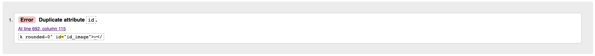

# Validation
## HTML
- Testing was carried out using Jigsaw - https://validator.w3.org/ 
- All pages passed except for the Product Management Page and the Shopping Bag.
- Product Management Page: The error said there was a duplicate ID image coming from the Django form, so I wasn't able to remove it.

- The Shopping bag had an error of duplicate ID. The main reason for this duplicate ID was because the include file for the quantty form has to appear twice in the DOM because it has a mobile view and larger screen view. 

## CSS
- Testing was carried out using Validator - https://validator.w3.org/nu/
- No errors were found when passing through the validator.

## PEP8
- I used the PEP8 validator on my Gitpod Workspace. All pages were cleared. 

# Manual Testing
To ensure cross-compatibility, I tested the website across numerous devices and web browsers. The site was tested across different iPhones, a Samsung, an iPad, a Mac laptop, and a Lenovo laptop. The site was also tested across Google Chrome and Safari. For responsiveness, I used the developer tool for screen adjustments, so I could see how the site would look on different screen sizes as I made the required adjustments for it to be completely responsive.

## Navigation Links
## Footer Links
## Register
## Login
## Logout
## Profile page
## Products page
## Bag
## Checkout

# Performance
## Desktop
## Mobile

# Bugs
## Solved Bugs
1. Problem: Programming Error when trying to access Heroku deployed link 
    - Cause: Site will only be connected to Elephant SQL satabase id DATABASE_URL is in env.py
    - Solution: Add DATABASE_URL value to env.py and run migrations for any outstanding 

2. Problem: NoReverseMatch when trying to add a review
    - Cause: Reviews URL not registered in base urls
    - Solution: Registered it in the base urls 

3. Problem: Testimonials App not appearing on the home page
    - Cause: The testiominals model wasn't added to the the home app view so home app wasn't aware of testimonials app
    - Solution: Testimonials was added to home app view

4. Problem: Delete confirmation modal, deleting a different product
    - Cause: The ID of the delete modal element was the same for every product
    - Solution: Create a dynamic ID, so each modal will have a different ID and be unique. Done using the products ID as the modal ID 

5. Problem: Reviews not submitting with star input
    - Cause: Radio buttons not being selected when clicked on as input is nested in li so when user selects the li, the radio isn't getting selected. 
    - Solution: Remove ratings field on the form in forms.py to grab the value in view that user choses from frontend. After, add rating request in the views Then use JS code to add checked property to the selected stars input to trigger it's value for the backend to pick up. 

## Outstanding Bugs
1. Problem: Confirmation Email not coming through
    - Cause: Network Error. Gmail servers down
    - Solution: 